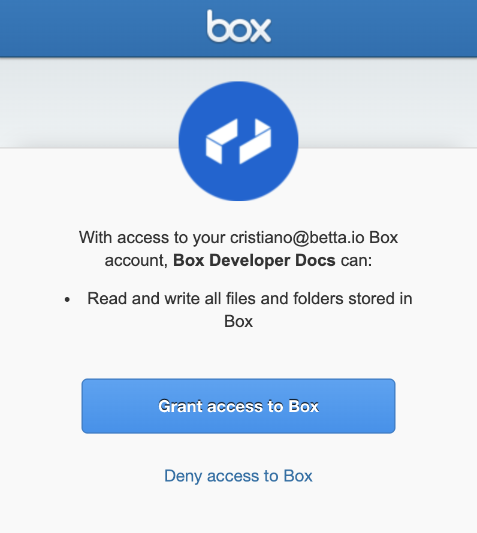
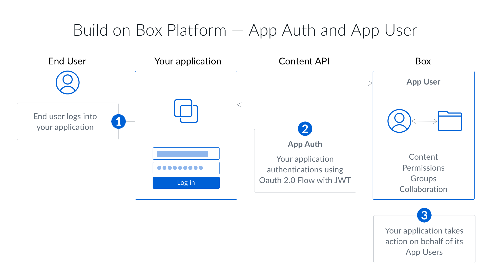

The type of authorization your application can use depends on the type of
Box Application that you've configured in the developer console.

<Card title="Learn how to select the application type for your app" href="/guides/applications/app-types/select"></Card>

The following authorization methods are available to each Box application type.

| Box Application Type         | Supports OAuth 2.0? | JWT? | Client Credentials? | App Token? |
| ---------------------------- | ------------------- | ---- | ------------------- | ---------- |
| [Platform App][custom-app]     | Yes                 | Yes  | Yes                 | No         | 
| [Limited Access App][la-app] | No                  | No  | No                  | Yes        |
| [Custom Skill][custom-skill] | No                  | No   | No                  | No         |

## Client-side

### OAuth 2.0

OAuth 2.0 requires the application to redirect end-users to their browser to
login to Box and authorize the application to take actions on their
behalf.

<ImageFrame center width="400" shadow border>
  
</ImageFrame>

<Note>
# When to use OAuth 2.0?

Client-side authentication is the ideal authentication method for apps that:

- work with users who have existing Box accounts
- use Box for identity management, so users know they are using Box
- store data within each user account vs. within an application's Service Account
</Note>

<Card title="Learn about client-side authentication with OAuth 2.0" href="/guides/authentication/oauth2"></Card>

## Server-side

### JWT

Server-side authentication using JSON Web Tokens (JWT) does not require end-user
interaction and, if granted the proper privileges, can be used to act on behalf
of any user in an enterprise. Identity is validated using a JWT assertion and
public/private keypair.

<ImageFrame center shadow border>

</ImageFrame>

<Note>
# When to use JWT?

Server-side authentication with JWT is the ideal authentication method for apps
that:

- work with users without Box accounts
- use their own identity system
- do not want users to know they are using Box
- store data within the application's Service Account and not a user's account
</Note>

<Card title="Learn about server-side authentication with JWT" href="/guides/authentication/jwt"></Card>

### Client Credentials Grant

Server-side authentication using Client Credentials Grant does not require
end-user interaction and, if granted the proper privileges, can be used to act
on behalf of any user in an enterprise. Identity is validated using the
application's client ID and client secret.

<Note>
# When to use a Client Credentials Grant?

Server-side authentication with Client Credentials Grant is the ideal
authentication method for apps that:

- work with users without Box accounts
- use their own identity management system
- do not want users to know they are using Box
- store data within the application's Service Account and not a user's account
</Note>

<Card title="Learn about server-side authentication with Client Credentials Grant" href="/guides/authentication/client-credentials"></Card>

### App Token

A server-side App Token is an authentication method where the application only
has access to read and write data to its own account. This is mainly used by Box
View applications. By using this authentication method there is no need to
authorize a user as the application is automatically authenticated as the
application's Service Account.

<Note>
# When to use App Tokens?

Server-side authentication with App Tokens is the ideal authentication method
for apps that:

- work in an environment that either has no user model, or has users without Box accounts
- use their own identity management system
- do not want users to know they are using Box
- store data within the application's Service Account and not a user's account
</Note>

<Card title="Learn about server-side authentication with App Tokens" href="/guides/authentication/app-token"></Card>

## Comparison

The following is a quick overview of the key difference between client-side and
server-side authentication.

|                                   | OAuth 2.0 | JWT | Client Credentials | App Tokens |
| --------------------------------- | --------- | --- | ------------------ | ---------- |
| Requires user involvement?        | Yes       | No  | No                 | No         |
| Requires admin approval?          | No        | Yes | Yes                | Yes        |
| Can act on behalf of other users? | Yes       | Yes | Yes                | No         |
| Do users see Box?                 | Yes       | No  | No                 | No         |
| Can create App Users?             | No        | Yes | Yes                | No         |

<Note>
An Access Token is tied to a specific Box user and the way the token has been
obtained determines who that user is.

For example, when using client-side authentication the token represents the
user who granted access to their account, while while when using server-side
authentication the token defaults to the application's Service Account.
</Note>

[custom-app]: /guides/applications/app-types/platform-apps
[custom-skill]: /guides/applications/app-types/custom-skills
[la-app]: /guides/applications/app-types/limited-access-apps
